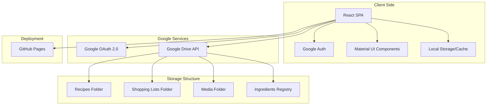
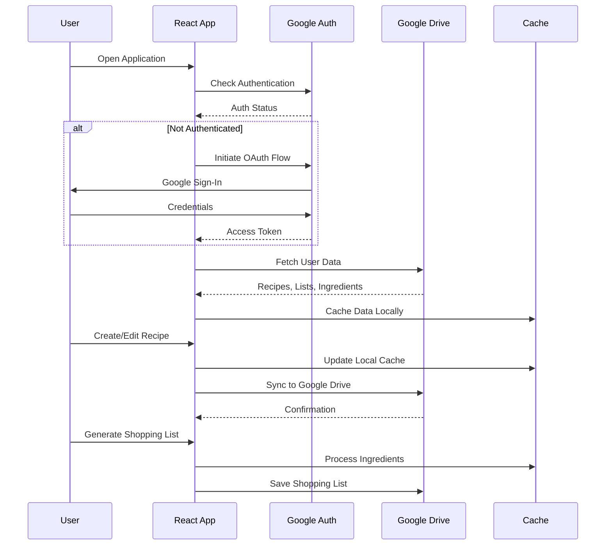
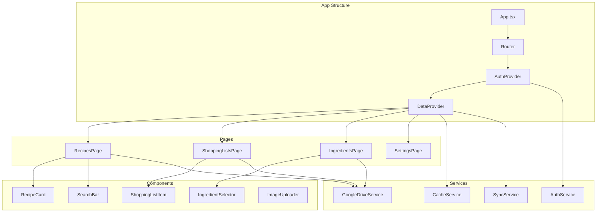
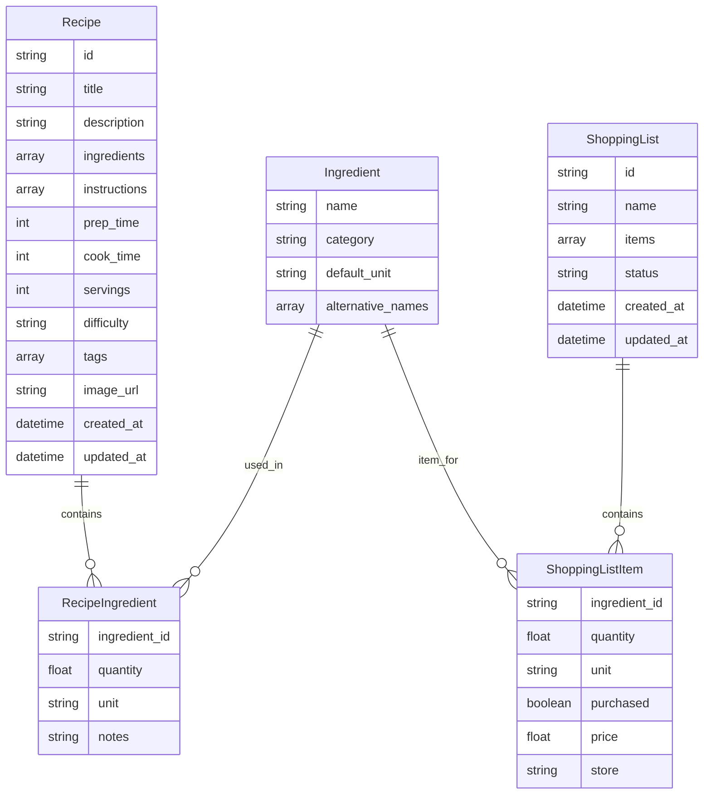

# Architecture

- React SPA (Single Page Application)
  - Using Vite
  - Using Material UI
  - Following best practices and always seeking to have common components where possible
- Authentication with Google Sign-In (OAuth 2.0)
- Storage with Google Drive
  - Use a folder for recipes in JSON format
  - Use a folder for pictures and other static content
  - Use a folder for storing each shopping list in JSON with their status
- Deployed as GitHub Pages

## Architecture Analysis & Recommendations

### Strengths
- Simple, focused single-user approach
- Leverages Google ecosystem for auth and storage
- Modern React stack with Vite for fast development
- Static deployment keeps costs minimal

### Recommendations

#### 1. Data Structure & Organization
- **Folder Structure**: Consider a hierarchical structure in Google Drive:
  ```
  /Recettier/
    ├── recipes/
    │   ├── metadata.json (recipe index)
    │   └── recipe-{id}.json
    ├── ingredients/
    │   └── ingredients-registry.json
    ├── shopping-lists/
    │   └── list-{id}.json
    └── media/
        ├── recipe-images/
        └── thumbnails/
  ```

#### 2. Performance Considerations
- **Caching Strategy**: Implement local storage/IndexedDB for offline access
- **Image Optimization**: Use thumbnail generation for recipe images
- **Lazy Loading**: Load recipes on-demand rather than all at once

#### 3. Data Synchronization
- **Conflict Resolution**: Handle concurrent edits (though single-user, multiple devices possible)
- **Incremental Sync**: Only sync changed data, not entire datasets
- **Version Control**: Consider adding version timestamps to prevent data loss

#### 4. Enhanced Features
- **Search & Filtering**: Full-text search across recipes and ingredients
- **Meal Planning**: Weekly/monthly meal planning with shopping list generation
- **Nutritional Information**: Integration with nutrition APIs
- **Recipe Sharing**: Export recipes as shareable links or PDFs

#### 5. Technical Improvements
- **State Management**: Consider Zustand or Context API for global state
- **Error Handling**: Robust error handling for Google Drive API failures
- **Progressive Web App**: Add PWA capabilities for mobile experience
- **Testing**: Unit and integration tests for core functionality

#### 6. Security & Privacy
- **Scoped Permissions**: Request minimal Google Drive permissions
- **Data Validation**: Validate all data before storing
- **Rate Limiting**: Handle Google API rate limits gracefully

## Architecture Diagrams

### System Overview


### Data Flow Architecture



### Component Architecture



### Recipe Data Model



## Technical Implementation Notes

### Google Drive Integration

- Use the Google Drive API v3 for file operations
- Implement proper error handling for network failures
- Consider batch operations for multiple file uploads
- Use resumable uploads for large media files

### State Management Strategy

```typescript
// Example store structure using Zustand
interface AppState {
  user: User | null;
  recipes: Recipe[];
  ingredients: Ingredient[];
  shoppingLists: ShoppingList[];
  isLoading: boolean;
  error: string | null;
}
```

### Caching Strategy

- Use IndexedDB for offline recipe storage
- Implement cache invalidation based on timestamps
- Store user preferences in localStorage
- Cache recipe images with service worker

### Performance Optimizations

- Implement virtual scrolling for large recipe lists
- Use React.memo for expensive components
- Lazy load images with intersection observer
- Debounce search inputs
